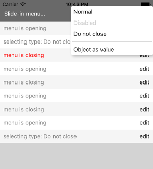

# react-native-popup-menu

Extensible popup menu component for React Native for both Android and iOS.

Features:
* Simple to use popup/context menu
* Multiple modes: animated, not animated or slide in from bottom
* By default opening and closing animations
* Easy styling
* Customizable on various levels - menu options, positioning, animations
* Can work as controlled as well as uncontrolled component
* Different lifecycle hooks


## Installation

```
npm install react-native-popup-menu --save
```

## Basic Usage
Wrap your application inside `MenuContext` and then simply use `Menu` component where you need it. Below you can find a simple example.

For more detailed documentation check [API](./doc/api.md).

```js
// your entry point
import { MenuContext } from 'react-native-popup-menu';

export const App = () => (
  <MenuContext>
    <YourApp />
  </MenuContext>
);

// somewhere in your app
import {
  Menu,
  MenuOptions,
  MenuOption,
  MenuTrigger,
} from 'react-native-popup-menu';

export const YourComponent = () => (
  <View>
    <Text>Hello world!</Text>
    <Menu>
      <MenuTrigger text='Select action' />
      <MenuOptions>
        <MenuOption onSelect={() => alert(`Save`)} text='Save' />
        <MenuOption onSelect={() => alert(`Delete`)} >
          <Text style={{color: 'red'}}>Delete</Text>
        </MenuOption>
        <MenuOption onSelect={() => alert(`Not called`)} disabled={true} text='Disabled' />
      </MenuOptions>
    </Menu>
  </View>
);

```

## Documentation

- [Examples](doc/examples.md)
- [API](doc/api.md)
- [Extension points](doc/extensions.md)

## Demo


## Contributing
Contributions are welcome! Just open an issues with any idea or pull-request if it is no-brainer. Make sure all tests and linting rules pass. 
