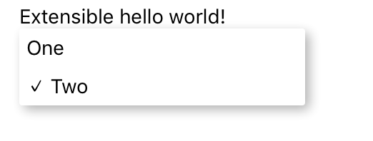
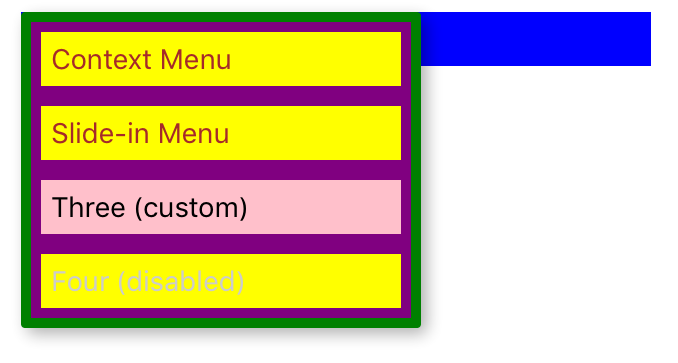

# Examples
## Basic menu
[BasicExample](../examples/BasicExample.js):
Most basic example showing menu in its uncontrolled form where menu automatically opens once user click the trigger or as a result of imperative API.


```js
<Menu onSelect={value => alert(`Selected number: ${value}`)}>
  <MenuTrigger text='Select option' />
  <MenuOptions>
    <MenuOption value={1} text='One' />
    <MenuOption value={2}>
      <Text style={{color: 'red'}}>Two</Text>
    </MenuOption>
    <MenuOption value={3} disabled={true} text='Three' />
  </MenuOptions>
</Menu>
```
Both `MenuTrigger` and `MenuOption` can have arbitrary children so you have full power over its styling.
Attribute `text` is just simple shorthand for `Text` child as it is the most common case.

## Declarative menu
[ControlledExample](../examples/ControlledExample.js):
Menu can be controlled also declaratively via properties.
```js
<Menu
  opened={this.state.opened}
  onBackdropPress={() => this.onBackdropPress()}
  onSelect={value => this.onOptionSelect(value)}>
  <MenuTrigger
    onPress={() => this.onTriggerPress()}
    text='Select option'/>
```

## Slide in menu
[Example](../examples/Example.js):
In addition to default popup menu, menu (options) can slide in from bottom of the screen.
```js
import { renderers } from 'react-native-popup-menu';
const { SlideInMenu } = renderers;
...
<Menu name="numbers" renderer={SlideInMenu} onSelect={value => this.selectNumber(value)}>
  <MenuTrigger style={styles.trigger}>
    <Text style={styles.triggerText}>Slide-in menu...</Text>
  </MenuTrigger>

```
You can select one of our provided `renderers` or you can write your own renderer.
This allow you to define animations, position of menu and much more.
Renderer can be set on menu level or globally via `Menu.setDefaultRenderer`.

For more details see [extensions](extensions.md) documentation.

## Custom menu options
[ExtensionExample](../examples/ExtensionExample.js):
You can also define your own `MenuOption`s if you want to use more complex options often.
Another nice use case is to have menu options with icons.


```js
<MenuOptions>
  <CheckedOption value={1} text='One' />
  <CheckedOption checked value={2} text='Two' />
</MenuOptions>
...
const CheckedOption = (props) => (
  <MenuOption {...props} text={(props.checked ? '\u2713 ' : '') + props.text} />
)
```
It is important to pass all (other) props to underlaying `MenuOption`.
For more details see [extensions](extensions.md) documentation.

## Styled menu
[StylingExample](../examples/StylingExample.js):
Although you can style options and triggers directly via its children,
you can achieve almost any styling `customStyles` property on various levels.


```js
<Menu renderer={this.state.renderer}>
  <MenuTrigger text='Select option' customStyles={triggerStyles} />
  <MenuOptions customStyles={optionsStyles}>
    <MenuOption text='Context Menu'
      onSelect={() => this.setState({renderer: ContextMenu})}/>
    <MenuOption text='Slide-in Menu'
      onSelect={() => this.setState({renderer: SlideInMenu})}/>
    <MenuOption text='Three (custom)' customStyles={optionStyles}
      onSelect={() => alert('Selected custom styled option')} />
    <MenuOption disabled={true}>
      <Text style={{color: '#ccc'}}>Four (disabled)</Text>
    </MenuOption>
  </MenuOptions>
</Menu>
...
const triggerStyles = {
  triggerText: {
    color: 'white',
  },
  triggerWrapper: {
    padding: 5,
    backgroundColor: 'blue',
  },
  triggerTouchable: {
    underlayColor: 'darkblue',
    activeOpacity: 70,
  },
};
```
For exact definitions of `customStyles` please refer to [API](api.md).
Also note that `MenuOption` can have either `value` or directly attached `onSelect` handler as in this case.


More examples can be found in [examples](../examples/) directory.
